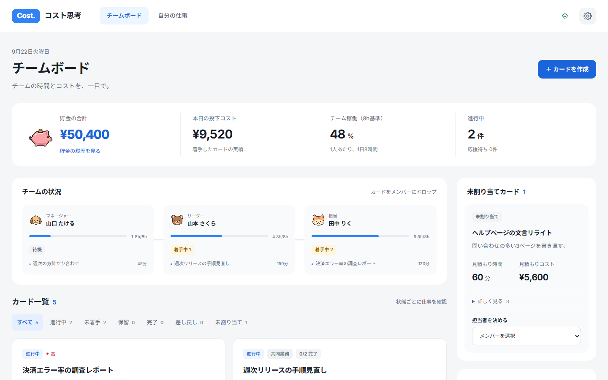
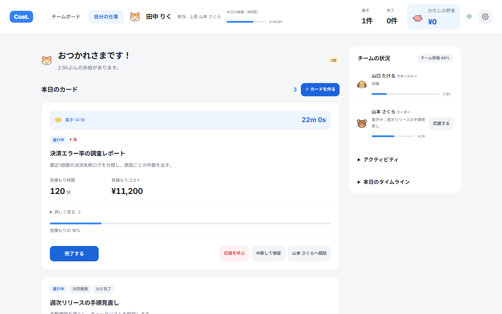
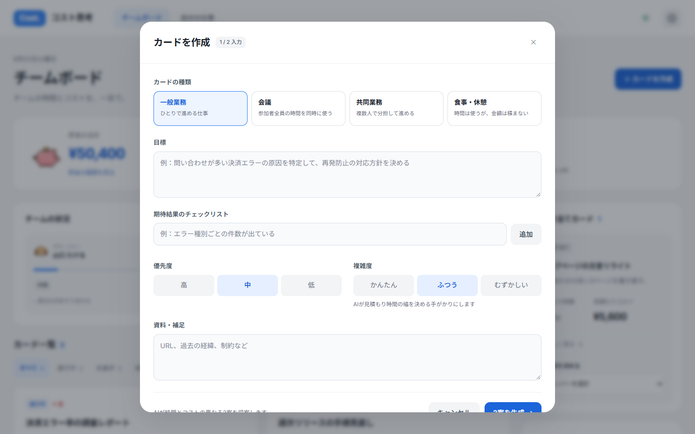
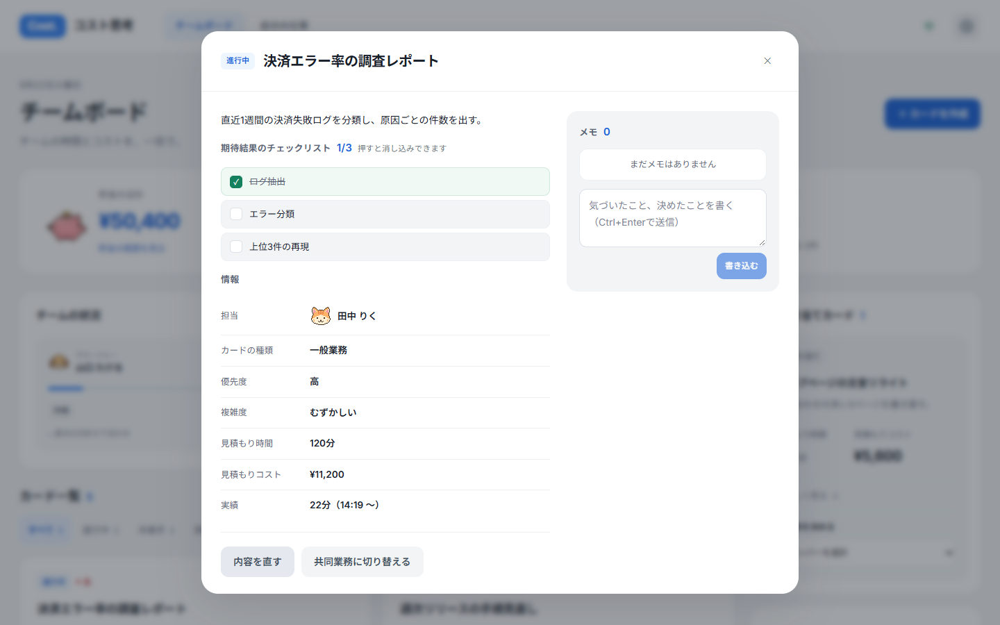
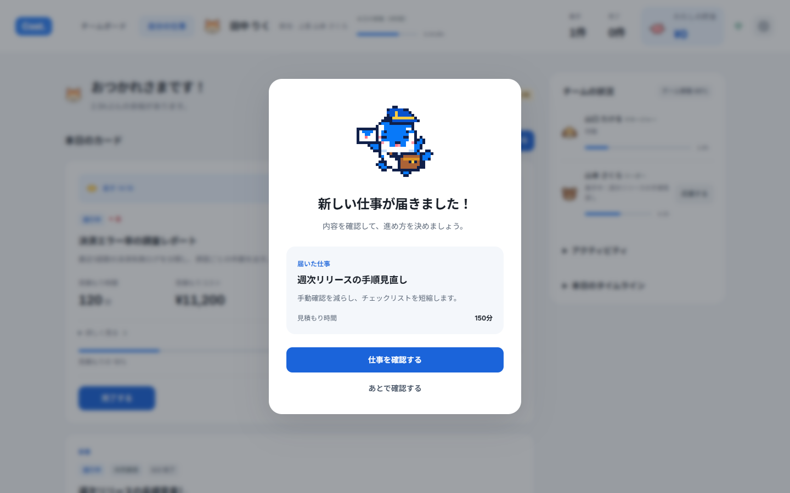

# コスト思考 — Cost Thinking

**仕事の時間を、金額で見せるチームボード。**
AI HACK 2026 第2回（テーマ：業務を自律化する AI エージェント）出品作。

- デモ: https://cost-thinking.vercel.app
- API: https://cost.blueberry-team.com



## なにをするものか

会議や作業の依頼を「カード」にすると、AI が **所要時間の異なる3案** を出します。
選んだ案の見積もり時間 × 人数 × チーム標準単価が、そのカードの **見積もりコスト** です。
担当が見積もりより早く終えると、浮いた金額が **貯金箱** に入ります。

```
この会議、8.4万円ぶんの時間です。
```

数字を見ながら「本当にこの人数で60分やる？」と考えてもらうための道具です。

## 画面

| チームボード（リーダー） | 自分の仕事（メンバー） |
|---|---|
|  |  |

| カードを作る | カードの詳細とメモ |
|---|---|
|  |  |

| 新しい仕事が届く |
|---|
|  |

## できること

- **カードの種類** — 一般業務（ひとり）／ 会議（参加者全員の時間を同時に使う）／ 共同業務（複数人で分担）／ 食事・休憩（時間は使うが金額は積まない）
- **AI の3案** — 「入力そのまま」「詳細を予測して追加」「一般業務ベース」。かかった AI の実費もその場に出ます
- **割り当て** — 組織図へドラッグ、または詳細画面でメンバーを押して参加
- **着手・完了** — 会議や共同業務は参加者それぞれが自分の手で動かします。全員が終えるとカードが完了になります
- **貯金** — 見積もりより早く終えたぶんが、チームの貯金箱と自分の貯金箱に入ります
- **応援** — 詰まったら応援を呼ぶ。入った人の時間はそのカードの実績に積まれます
- **メモ・チェックリスト** — カードを開くと Jira のように詳細が出て、メモを残したり、チェックリストを消し込んだりできます
- **時間の予約** — 会議・共同業務に開始時刻を入れると、その時刻にサーバーが自動で始めます
- **3言語** — 日本語・韓国語・英語。人が書いた文（カードの本文・メモ）は登録直後に AI が非同期で訳し、届き次第それぞれの画面に反映されます

## 見積もりの考え方

金額は AI ではなくコードが決めます。AI が触るのは「何をするか」と「何分かかるか」だけです。

```
見積もりコスト = 見積もり時間（分）÷ 60 × 人数 × チーム標準単価
貯金          = max(0, 見積もり時間 − 実績時間) ÷ 60 × 人数 × チーム標準単価
```

- **チーム標準単価** は等級ごとの時給（年収 ÷ 1,920h × 間接費 1.35）を平均し、100円単位に丸めた1本の数字です。個人の時給は画面にも見積もりにも出しません。誰が担当するかで見積もりが揺れると「見積もりと実績の差＝貯金」が何を意味するのか分からなくなるためです
- **AI が落ちても数字は出ます。** 準備 30分 ＋ 期待結果1件につき 20分 ＋ 目標 20字につき 15分 × 複雑度（0.7 / 1.0 / 1.6）、会議は 30分 ＋ 人数 × 15分。この式が AI の基準線でもあり、失敗時の受け皿でもあります
- **給与・氏名はモデルに渡しません。** 渡すのは目標・期待結果・資料と役職だけです

## AI（OrcaRouter）の使い方

OpenAI 互換の [OrcaRouter](https://www.orcarouter.ai/) を通して呼びます。

| 用途 | 既定モデル | 受け皿 |
|---|---|---|
| カード3案の生成 | `google/gemini-2.5-flash` | `deepseek/deepseek-v4-flash-free` → `openai/gpt-5-nano` → ルールベース |
| 本文・メモの翻訳 | 同上 | 同上（失敗したら原文のまま） |

- `X-OrcaRouter-Include-Cost: true` で返る **実費（`usage.cost_usd`）をそのまま画面に出します**。1回あたり約 $0.004
- `models` の並びで別ベンダーへフォールバック。無料モデルが混雑（429）していたら、無料を外した並びでもう一度だけ叩きます
- 応答は `{"candidates":[…]}` でも `[…]` でも読みます。モデルによって形が違うためです
- 翻訳は登録を待たせません。goroutine で後から訳し、終わったら WebSocket で全員に配ります

## 構成

```
frontend/   Next.js 16（App Router）。Vercel に置く。API とは REST + WebSocket で話す
server/     Go 1.26。API + WebSocket + SQLite（盤面を JSON ドキュメント1つで保存）
tools/      アバターとオルカのピクセル画像を作るスクリプト
```

盤面の変更はすべて `mutate()` を通ります：ロック → 変更 → 保存 → rev++ → 全クライアントへ配信。
画面は自分で状態を持たず、届いた盤面を描くだけです。

## ローカルで動かす

```bash
# API（:8096）
cd server
ORCAROUTER_API_KEY=sk-... ALLOW_ORIGINS=http://localhost:3000 go run .

# 画面（:3000）
cd frontend
npm install
NEXT_PUBLIC_API_BASE=http://127.0.0.1:8096 npm run dev
```

`ORCAROUTER_API_KEY` が無くてもルールベースで動きます。

### 環境変数（server）

| 変数 | 既定 | 役割 |
|---|---|---|
| `PORT` | `8096` | 待ち受けポート |
| `DB_PATH` | `./data/board.db` | SQLite の場所 |
| `ORCAROUTER_API_KEY` | （なし） | 無ければ AI を使わずルールベース |
| `ALLOW_ORIGINS` | （なし） | CORS で許可する画面の origin（カンマ区切り。`*.vercel.app` は常に許可） |
| `WEB_DIR` | （なし） | 置くと静的ファイルも配信する（通常は Vercel に任せる） |

### Docker

```bash
echo "ORCAROUTER_API_KEY=sk-..." > .env
docker compose up -d --build     # http://localhost:8096/api/health
```

## API

| メソッド | パス | 役割 |
|---|---|---|
| GET | `/api/state` | 盤面の全状態 |
| GET | `/ws` | 盤面の更新を配信（WebSocket） |
| POST | `/api/ai/candidates` | AI に3案を出させる |
| POST | `/api/cards` | カード作成（翻訳は非同期） |
| POST | `/api/cards/update` | 本文の修正。差し戻されたカードを直して戻す |
| POST | `/api/cards/move` | 割り当て・委任・エスカレーション |
| POST | `/api/cards/status` | 着手・保留・完了・差し戻し |
| POST | `/api/cards/progress` | 会議・共同業務での「自分ぶん」の着手・完了 |
| POST | `/api/cards/kind` | 一般業務 ⇄ 共同業務の切り替え、参加・離脱 |
| POST | `/api/cards/schedule` | 開始時刻の予約 |
| POST | `/api/cards/check` | チェックリストの消し込み |
| POST | `/api/cards/comment` | メモ（翻訳は非同期） |
| POST | `/api/cards/join` `/leave` | 応援の参加・離脱 |
| POST | `/api/help/request` `/offer` `/resolve` | 応援の要請・参加・解消 |
| POST | `/api/savings` | 貯金の記録 |
| POST | `/api/avatar` | 自分の顔（ライオン・クマ・ネコ・イヌ）を選ぶ |
| POST | `/api/seed` `/api/reset` | デモデータの投入・初期化 |

## 設計で決めたこと

- **AI に金額を計算させない。** 見積もり時間だけをもらい、金額はコードが決める。給与はモデルに渡さない
- **AI が止まってもサービスは止めない。** ルールベースの3案、原文のままの表示、どちらも「AI なし」で成立する
- **実費を隠さない。** OrcaRouter が返した cost_usd をそのまま出す
- **人の判断を道具が奪わない。** 会議の時刻になっても他のカードを勝手に止めない。何を止めて何を続けるかは人が決める
- **待たせない。** 翻訳も予約の発火もサーバーの裏で動き、終わったら WebSocket で届く

## ライセンス

MIT
